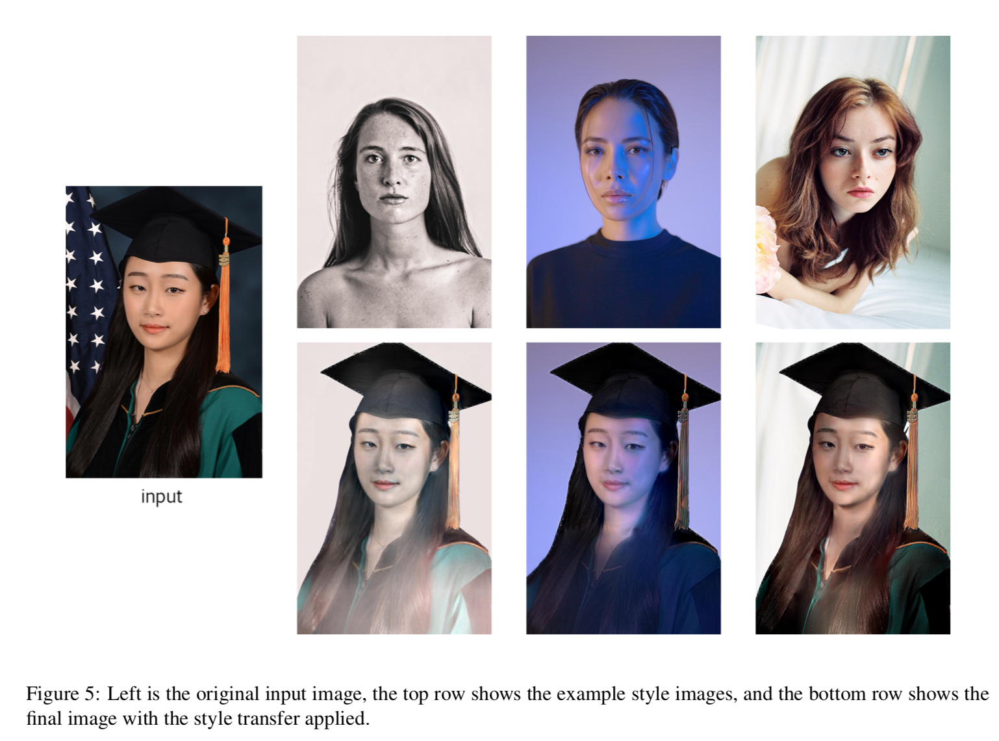

# Python Implementation of YiChang Shih's "Style Transfer for Headshots Portraits"
Python and Matlab implementation of the paper [http://www.connellybarnes.com/work/publications/2014_portrait.pdf](http://www.connellybarnes.com/work/publications/2014_portrait.pdf).




##### Requirements
- matlab	>= 0.1
- numpy	>= 1.14.5
- scikit-image	>= 0.14.1
- scipy	>= 1.1.0
- opencv2
- pickle

##### Input
- portrait image
- style image
- portrait mask
- style mask

##### Run
Change input parameter in `__main__` from `run.py` and run
```
python run.py
```

##### References
[1] YiChang Shih, Sylvain Paris, Connelly Barnes, William T. Freeman, and Fre ́do Durand. Style transfer for headshot portraits. ACM Trans. Graph., 33(4):148:1–148:14, July 2014.   
[2] L. A. Gatys, A. S. Ecker, and M. Bethge. Image style transfer using convolutional neural networks. In 2016 IEEE Conference on Computer Vision and Pattern Recognition (CVPR), pages 2414–2423, June 2016.   
[3] J. M. Saragih, S. Lucey, and J. F. Cohn. Face alignment through subspace constrained mean-shifts. In 2009 IEEE 12th International Conference on Computer Vision, pages 1034–1041, Sep. 2009.   
[4] Thaddeus Beier and Shawn Neely. Feature-based image metamorphosis. SIGGRAPH Comput. Graph., 26(2):35–42, July 1992.   
[5] Q. Chen, D. Li, and C. Tang. Knn matting. IEEE Transactions on Pattern Analysis and Machine Intelligence, 35(9):2175–2188, Sep. 2013.
